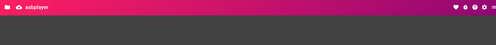

    

# asbplayer with automatic subtitles for anime

https://zakwarsame.github.io/asbplayer/

1. Create an account and copy your key from here (you only need to do this once): https://jimaku.cc/login
   

2. Click on the cloud icon
   

3. paste key and then search

---

https://github.com/user-attachments/assets/5a7f0c93-5c30-49bc-a816-04441a53bddc

Code for getting the subs is from [asb-auto-subs](https://github.com/GodPepe7/asb-auto-subs)
